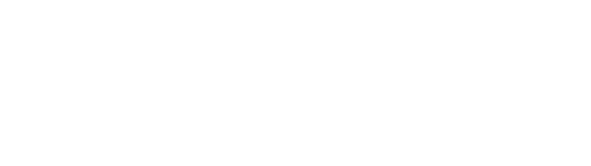
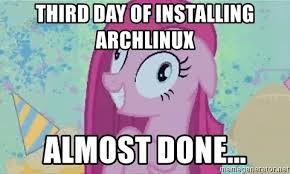

# What is mrczlnks?

`mrczlnks` is a featureful, yet simple linux distribution (as the subtitle suggests), more specifically it's an Arch Linux installation script that is free to fork, modify to fit your own purposes and use!

Due that's software needed for me personally and has no other purpose other than mine, at least for me, I will not **_fuggin'_** provide any dedicated support for this script because that's *my* script, and not directly *yours*, so you're advised! :beers: :kiss:

# WAIT A SINGLE F*****G SECOND

Have you really made an Arch Linux installation script? Are you a n00b dude? 

Didn't you read the documentation and the [Holy Installation Guide](https://wiki.archlinux.org/index.php/Installation_guide)? 

Did you actually read that people online are complaining that these install scripts are for n00bs and people that dOn'T kNoW hOw To InStAlL aRcH lInUx?!1! Are you ONE OF THOSE PPL? RLY?!?! SCREW YOU, IMMA DO IT "THE RIGHT WAY"!!!!11


You now, but with a friend because you know you need mental support in doing it:


You after you friend left bored right after you fucked up the installation for the 19th time:



...that's why, mate. Still lovin' ya, don't worry :heart:

## So, here is a fun Disclaimer

THIS PIECE OF SOFTWARE IS PROVIDED AS IS, WITHOUT WARRANTIES OF ANY KIND. I AM NOT RESPONSIBLE FOR ANY USAGE OF THIS SCRIPT, OR ANY IMPORTANT DISK ACCIDENTALLY FORMATTED BY THIS INSTALL SCRIPT, OR YOUR ENTIRE SYSTEM EXPLODING, OR WHATEVER.

REALLY. USE AT YOUR OWN RISK. xoxo

## Usage

- Download the official Arch Linux .iso file from the [official site download section](https://www.archlinux.org/download/)

- Flash it onto an USB drive with softwares like `dd`, Rufus, balenaEtcher or whatever, stick it in the desired PC and boot the provided live environment, as per the ArchWiki installation page

- Inside this live environment you should now connect to the internet using either ethernet or wifi as you like (use `wifi-menu` or `nmcli` or as your preference), then download the latest script from this repository with the following command:

```bash
wget https://raw.githubusercontent.com/ilbuonmarcio/mrczlnks/master/install.sh
```

- Modify it to fit your own purposes (I suggest you to edit the partition mounts, change hostname, username, purge packages and features you don't need and so on, or do like [zetaemme](https://github.com/zetaemme/zls) and fork this repository as a base for your own Arch Linux install script!)

```bash
vim ./install.sh
```

- Change file permissions to make it executable, of course!

```bash
chmod 700 ./install.sh
```

- Edit `/etc/pacman.conf` file, making sure `[multilib]` repository is enabled or it won't work!

- Execute `install.sh` script and insert the information required when prompted

```bash
./install.sh
```

Once the script propmts you that it finished, you can just `reboot`, remove the USB drive previously inserted and finally start using your new distribution!

### License

This software is released under MIT License.
Read LICENSE for more information.
